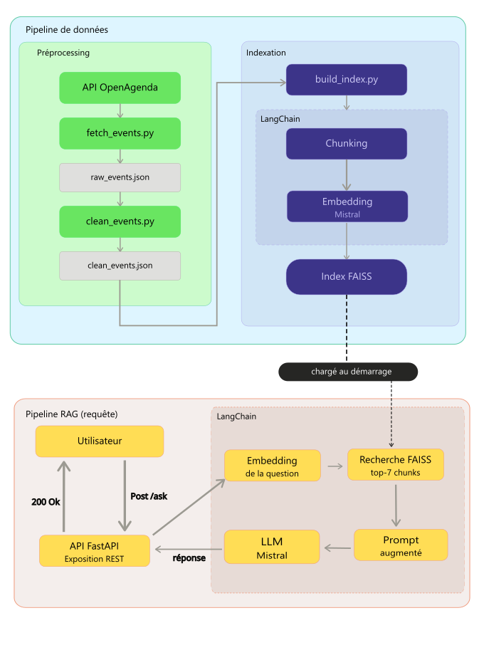
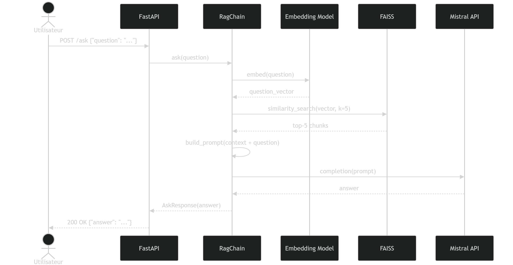
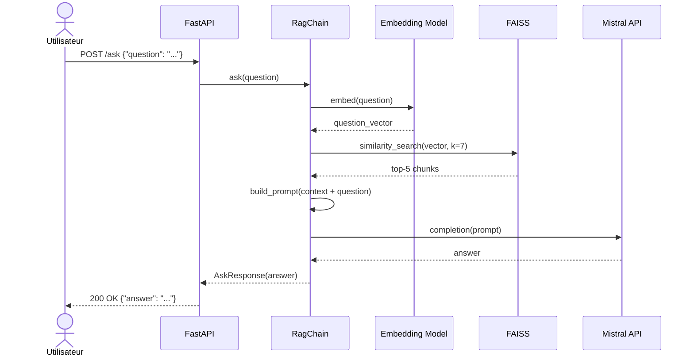

# Rapport technique — Assistant intelligent de recommandation d'événements culturels

**Projet :** POC RAG Puls-Events  
**Auteur :** Raphael  
**Date :** Avril 2026  
**Version :** 0.1.0

## Table des matières

1. [Objectifs du projet](#1-objectifs-du-projet)
2. [Architecture du système](#2-architecture-du-système)
3. [Préparation et vectorisation des données](#3-préparation-et-vectorisation-des-données)
4. [Choix du LLM](#4-choix-du-llm)
5. [Construction de la base vectorielle](#5-construction-de-la-base-vectorielle)
6. [API et endpoints exposés](#6-api-et-endpoints-exposés)
7. [Évaluation du système](#7-évaluation-du-système)
8. [Recommandations et perspectives](#8-recommandations-et-perspectives)
9. [Organisation du dépôt GitHub](#9-organisation-du-dépôt-github)
10. [Annexes](#10-annexes)

## 1. Objectifs du projet

### Contexte

**Puls-Events** est une entreprise technologique développant une plateforme de recommandations culturelles personnalisées. Dans le cadre d'une mission freelance, le présent POC vise à démontrer la faisabilité d'un chatbot intelligent capable de répondre à des questions utilisateurs sur les événements culturels à venir.

### Problématique

Les moteurs de recherche classiques (par mots-clés) ne permettent pas de comprendre l'intention derrière une question comme *"Que faire ce week-end avec mes enfants ?"*. Un système **RAG (Retrieval-Augmented Generation)** répond à ce besoin en combinant :

- Une **recherche sémantique** dans une base d'événements (compréhension du sens, pas juste des mots)
- Une **génération de réponse en langage naturel** à partir des documents retrouvés (réponse contextuelle et formulée)

Cela permet d'offrir une expérience conversationnelle pertinente, ancrée dans des données réelles et récentes.

### Objectif du POC

L'idée de ce POC est de montrer qu'on peut construire un assistant de recommandation culturelle basé sur RAG, fonctionnel de bout en bout. Concrètement, ça veut dire : partir des données brutes OpenAgenda et arriver à une réponse générée, via une API interrogeable par les équipes produit et marketing. Le tout devait être évalué automatiquement et reproductible via Docker.

### Périmètre

| Critère | Valeur |
|---|---|
| Zone géographique | Île-de-France |
| Source de données | API OpenAgenda (via OpenDataSoft) |
| Période couverte | 1 mois avant la date du build + 6 mois à venir |
| Volume d'événements | jusqu'à 1 000 événements |
| Langue | Français |

## 2. Architecture du système

### Schéma global



### Diagramme de séquence UML (appel `/ask`)



*Source Mermaid disponible en [Annexe E](#annexe-e--diagramme-de-séquence-source-mermaid).*

### Technologies utilisées

| Technologie | Version | Rôle |
|---|---|---|
| Python | ≥ 3.8 | Langage principal |
| LangChain | ≥ 0.2.0 | Orchestration du pipeline RAG |
| langchain-mistralai | ≥ 0.1.0 | Intégration Mistral (LLM + embeddings) |
| FAISS (`faiss-cpu`) | ≥ 1.7.4 | Index de recherche vectorielle |
| FastAPI | ≥ 0.111.0 | API REST + documentation Swagger |
| Uvicorn | ≥ 0.30.0 | Serveur ASGI |
| Ragas | 0.2.15 | Évaluation automatique des réponses |
| Docker | 20.10.23 | Conteneurisation |
| python-dotenv | ≥ 1.0.0 | Gestion des variables d'environnement |

### Rôle des composants

J'ai découpé le pipeline en scripts indépendants, chacun responsable d'une étape. Ça facilite les tests et le debug — on peut relancer un script sans tout recommencer depuis le début.

| Composant | Fichier | Rôle |
|---|---|---|
| **Récupération** | `scripts/fetch_events.py` | Interroge l'API OpenDataSoft, pagine les résultats et persiste les événements bruts dans `data/raw_events.json` |
| **Nettoyage** | `scripts/clean_events.py` | Filtre, normalise et enrichit les données brutes ; construit le champ `text` composite utilisé pour la vectorisation |
| **Indexation** | `scripts/build_index.py` | Découpe les textes en chunks, génère les embeddings via `mistral-embed` et construit l'index FAISS persisté dans `index/faiss_index/` |
| **Pipeline RAG** | `scripts/rag_chain.py` | Charge l'index, expose la fonction `ask()` qui orchestre la recherche FAISS et la génération Mistral via LangChain |
| **API** | `api/routes.py` | Définit les endpoints FastAPI (`/ask`, `/rebuild`, `/health`, `/metadata`) et délègue la logique RAG à `rag_chain.py` |
| **Évaluation** | `tests/evaluate_rag.py` | Interroge le système sur le jeu de test annoté et calcule les métriques Ragas ; les résultats sont horodatés dans `results/` |

## 3. Préparation et vectorisation des données

### Source de données

Les événements sont récupérés via l'**API publique OpenDataSoft** exposant le jeu de données OpenAgenda :

```
https://public.opendatasoft.com/api/explore/v2.1/catalog/datasets/evenements-publics-openagenda/records
```

**Paramètres de filtrage appliqués :**

| Paramètre | Valeur | Description |
|---|---|---|
| `location_region` | `Île-de-France` | Filtre géographique |
| `firstdate_begin` | J-30 → J+180 | Fenêtre glissante : 1 mois avant la date du build + 6 mois à venir |
| `PAGE_SIZE` | `100` | Maximum autorisé par ODS |
| `MAX_EVENTS` | `1000` | Plafond total de récupération |

La pagination est gérée automatiquement avec un offset incrémental jusqu'à 1 000 événements maximum.

### Nettoyage des données (`clean_events.py`)

Les données brutes de l'API OpenAgenda présentent plusieurs irrégularités qu'il a fallu corriger avant indexation : champs vides, balises HTML, JSON imbriqués dans des strings... Le script s'occupe de deux choses :

**Nettoyage général** (données stockées dans le JSON) :

| Opération | Description |
|---|---|
| **Filtrage champs obligatoires** | Les événements sans titre (`title_fr`) sont écartés |
| **Fallback description** | Si `description_fr` est vide, le titre est utilisé comme substitut |
| **Gestion des doublons** | Les événements avec UID identique sont dédupliqués |
| **Suppression HTML** | Les balises HTML dans `longdescription_fr` sont retirées via regex |
| **Normalisation géographique** | Noms de départements (`Seine-St-Denis` → `Seine-Saint-Denis`), arrondissements parisiens déduits du code postal |
| **Normalisation des quartiers** | Suppression des préfixes `Quartier de / du / des` ; variantes de `Centre-Ville` unifiées |
| **Parsing JSON imbriqué** | Champs `attendancemode` et `status` dé-sérialisés pour extraire le label français |
| **Tranche d'âge** | `age_max` ignoré si ≥ 99 |

**Construction du champ `text`** (utilisé pour la vectorisation) :

Tous les champs utiles (titre, description, dates, lieu, quartier, conditions, âge, accessibilité) sont concaténés en un seul champ texte séparé par ` | `. Une attention particulière est portée à éviter les répétitions : si la description longue commence par la description courte, le doublon est retiré.

**Exemples d'anomalies corrigées :**

| Champ | Valeur brute (API) | Valeur après nettoyage |
|---|---|---|
| `location_dept` | `"Seine-St-Denis"` | `"Seine-Saint-Denis"` |
| `description_fr` | *(vide)* | `"Atelier poterie"` *(titre utilisé en fallback)* |
| `longdescription_fr` | `"<p>Venez découvrir…<br/>Entrée libre</p>"` | `"Venez découvrir… Entrée libre"` |
| `attendancemode` | `'{"fr": "En présence"}'` *(JSON en string)* | `"En présence"` |
| `age_max` | `99` | *(ignoré — valeur sentinelle "tous publics")* |
| `location_district` | `"Quartier du Marais"` | `"Marais"` |

**Exemple de champ `text` généré :**
```
Titre : Concert de jazz | Description : Soirée jazz au cœur de Paris. | Détails : Une soirée intime dans une salle intimiste. | Conditions : Entrée libre | Dates : 15 avril 2026 | Lieu : Café de la Danse | Adresse : 5 passage Louis-Philippe, 75011 Paris | Quartier : Charonne | Âge : à partir de 18 ans | Accessibilité : Accès PMR
```

**Champs conservés dans les métadonnées :**
`uid`, `title`, `description`, `long_description`, `conditions`, `keywords`, `daterange`, `firstdate_begin`, `lastdate_end`, `location_name`, `location_address`, `location_city`, `location_district`, `location_postalcode`, `location_dept`, `location_region`, `coordinates`, `age_min`, `age_max`, `accessibility`, `attendancemode`, `status`, `url`, `text`

### Chunking

Le découpage en chunks est réalisé avec `RecursiveCharacterTextSplitter` :

| Paramètre | Valeur | Justification |
|---|---|---|
| `chunk_size` | 700 caractères | J'ai d'abord essayé 500 caractères, mais les métriques Ragas étaient moins bonnes. Mon hypothèse : à 500 caractères, un événement se retrouvait coupé en plein milieu, ce qui faisait perdre le contexte global. En passant à 700, les scores se sont améliorés. |
| `chunk_overlap` | 50 caractères | Évite la perte d'information en limite de chunk |
| `separators` | `[" \| ", "\n\n", "\n", " ", ""]` | Respecte la structure du champ texte composite |

### Embedding

Les vecteurs sémantiques sont générés via l'**API Mistral** :

| Paramètre | Valeur |
|---|---|
| Modèle | `mistral-embed` |
| Dimension | 1024 |
| Type | Float32 |
| Batch | Géré automatiquement par LangChain |

## 4. Choix du modèle NLP

### Modèle sélectionné

Le modèle de génération retenu est **Mistral AI** (`mistral-small-latest`) :

| Rôle | Modèle | Justification |
|---|---|---|
| **Génération** | `mistral-small-latest` | Bon rapport qualité/coût, suffisant pour un POC, temps de réponse raisonnable |

### Pourquoi Mistral ?

J'ai choisi Mistral pour plusieurs raisons pratiques : sa qualité en français est bien adaptée aux contenus culturels francophones, son intégration dans LangChain est native via `langchain-mistralai`, et l'accès par API évite d'avoir à gérer une infrastructure GPU — ce qui est idéal dans le cadre d'un POC.

### Prompt de base

```
Tu es un assistant spécialisé dans les événements culturels en Île-de-France.
Ce système couvre uniquement les événements culturels en Île-de-France.
La date d'aujourd'hui est le {today}.
Si la question porte sur une région hors Île-de-France, indique clairement que la base est limitée
à l'Île-de-France et qu'aucun événement hors de cette région n'est disponible.
Réponds à la question en t'appuyant uniquement sur les événements fournis ci-dessous.
Si aucun événement ne correspond, dis-le clairement sans proposer de sources externes.

Événements pertinents :
{context}

Question : {question}

Réponse :
```

**Choix de conception :**
- `temperature=0.2` : réponses factuelles et reproductibles, tout en conservant une formulation naturelle
- `k=7` : les 7 chunks les plus proches sémantiquement sont injectés en contexte
- Date du jour injectée dynamiquement pour traiter les questions temporelles relatives
- Périmètre géographique explicite pour éviter les réponses hors-sujet
- Instruction de transparence sur l'absence de résultat (évite les hallucinations)
- Pas d'historique de conversation (hors périmètre POC)

### Limites du modèle

- **Fenêtre de contexte** : si les 5 chunks sont très longs, le contexte peut être tronqué
- **Dépendance au retrieval** : si FAISS ne remonte pas les bons chunks, le LLM répond sur une mauvaise base — le risque d'hallucination dépend directement de la qualité du retrieval
- **Pas de filtering post-retrieval** : des chunks hors sujet peuvent être inclus dans le contexte, dégradant la précision de la réponse
- **Pas d'historique de conversation** : chaque question est traitée de manière indépendante (hors périmètre POC)

## 5. Construction de la base vectorielle

### FAISS utilisé

L'index FAISS est construit via `FAISS.from_documents()` de LangChain, qui utilise par défaut un **index `IndexFlatL2`** (recherche exacte par distance L2). Pour un POC à moins de 10 000 chunks, ça suffit largement : la recherche est exacte et les temps de réponse restent corrects. Si le volume grossissait vraiment, il faudrait passer à un index approximatif (HNSW ou IVF), mais ça n'avait pas de sens ici.

### Stratégie de persistance

| Élément | Valeur |
|---|---|
| Répertoire | `index/faiss_index/` |
| Fichiers générés | `index.faiss` + `index.pkl` (métadonnées) |
| Format | Binaire FAISS natif |
| Chargement | `FAISS.load_local()` |

L'index est chargé **au premier appel à `/ask`** puis mis en cache en mémoire (`_index`, `_chain`) pour éviter de le recharger à chaque requête (lazy loading).

### Métadonnées associées

Chaque document FAISS conserve les métadonnées suivantes, accessibles après retrieval :

- **Identification** : `uid`, `title`, `url`
- **Dates** : `firstdate_begin`, `lastdate_end`
- **Lieu** : `location_name`, `location_city`, `location_district`, `location_dept`
- **Infos pratiques** : `conditions` (gratuit, payant…), `age_min`, `age_max`, `accessibility`

## 6. API et endpoints exposés

### Framework utilisé

**FastAPI** a été retenu pour :
- La **génération automatique de la documentation Swagger** (`/docs`)
- La **validation des types** via Pydantic
- L'**intégration native** avec les schémas de données

### Endpoints

#### `GET /health`
Vérifie que l'API est opérationnelle.

```json
// Réponse 200
{"status": "ok"}
```

#### `GET /metadata`
Retourne des informations sur la base indexée.

```json
// Réponse 200
{
  "total_events": 847,
  "last_rebuilt": "2026-04-07T09:00:00",
  "first_event_date": "2025-04-08T00:00:00+00:00",
  "last_event_date": "2026-10-08T00:00:00+00:00",
  "departments": ["Essonne", "Hauts-De-Seine", "Paris", "Seine-Et-Marne", "Val-De-Marne", "Val-D'Oise", "Yvelines"],
  "districts": ["Belleville", "Charonne", "Montmartre", "Saint-Lambert", ...]
}
```

#### `POST /ask`
Pose une question au système RAG.

**Requête :**
```json
{"question": "Quels concerts gratuits ont lieu à Paris ce mois-ci ?"}
```

**Réponse :**
```json
{
  "answer": "Voici les concerts gratuits prévus à Paris : ..."
}
```

**Codes d'erreur gérés :**

| Code | Cause |
|---|---|
| 422 | Question vide |
| 503 | Index FAISS introuvable (lancer `/rebuild` d'abord) |
| 429 | Limite de requêtes Mistral atteinte |
| 500 | Erreur serveur inattendue |

#### `POST /rebuild` *(authentification requise)*
Reconstruit l'index FAISS depuis les données nettoyées.

**Header requis :** `X-API-Key: <clé configurée dans .env>`

```json
// Réponse 200
{
  "message": "Index FAISS reconstruit avec succès.",
  "chunks_indexed": 3241
}
```

> La route `/rebuild` est protégée par une clé API pour éviter une reconstruction intempestive en cas d'exposition publique.

### Exemples d'appels

**curl :**
```bash
# Vérification de l'état
curl http://localhost:8000/health

# Question au système RAG
curl -X POST http://localhost:8000/ask \
  -H "Content-Type: application/json" \
  -d '{"question": "Y a-t-il des spectacles pour enfants en Île-de-France ?"}'

# Reconstruction de l'index
curl -X POST http://localhost:8000/rebuild \
  -H "X-API-Key: votre_cle_api"
```

**Python requests :**
```python
import requests

response = requests.post(
    "http://localhost:8000/ask",
    json={"question": "Quels événements musicaux sont prévus à Versailles ?"}
)
print(response.json()["answer"])
```

**Postman :**
Une collection Postman complète couvrant tous les endpoints (nominal, hors périmètre, rebuild avec et sans auth) est disponible dans [`docs/demo.postman_collection.json`](demo.postman_collection.json). Importer le fichier dans Postman et renseigner la variable `BASE_URL` (`http://localhost:8000`) pour tester l'API sans écrire de code.

### Documentation interactive

La documentation Swagger est disponible automatiquement à l'adresse :
```
http://localhost:8000/docs
```

### Tests effectués et documentés

Les tests fonctionnels de l'API sont définis dans `tests/api_test.py` avec `pytest` et `httpx`. Ils couvrent les scénarios suivants :

| Endpoint | Scénario testé | Résultat attendu |
|---|---|---|
| `GET /health` | Appel nominal | `200 {"status": "ok"}` |
| `GET /metadata` | Appel nominal | `200` avec champs `total_events`, `departments`, etc. |
| `POST /ask` | Question valide | `200` avec champ `answer` non vide |
| `POST /ask` | Question vide (`""`) | `422 Unprocessable Entity` |
| `POST /rebuild` | Sans clé API | `403 Forbidden` |
| `POST /rebuild` | Avec clé API valide | `200` avec `chunks_indexed > 0` |

Tous ces tests passent dans le pipeline CI (GitHub Actions). La documentation Swagger (`/docs`) permet également de tester chaque endpoint interactivement sans code.

## 7. Évaluation du système

### Jeu de test annoté

Un jeu de données de référence de **12 questions annotées manuellement** a été constitué dans `tests/annotated_qa.json`. Ce jeu de test couvre les principaux cas d'usage et permet de détecter les comportements aberrants, mais reste limité : avec seulement 12 questions, un score atypique sur une seule entrée peut faire varier significativement la moyenne. Pour une mise en production, un jeu d'au moins 50 questions serait nécessaire pour des résultats statistiquement fiables.

**Méthode d'annotation :**
Les questions et réponses de référence ont été rédigées et annotées manuellement, sur la base des données réellement présentes dans l'index. Chaque réponse attendue a été formulée en langage naturel après vérification directe dans les données sources, sans utiliser le système RAG pour ne pas biaiser l'évaluation.

**Critères de construction :**
- Couverture des principaux cas d'usage (événements gratuits, par genre musical, par type de lieu, pour enfants, par département...)
- Inclusion de questions hors périmètre géographique (Lyon, Marseille) pour tester la capacité à dire "je ne sais pas"
- Questions ambiguës (sans date précise) pour identifier les limitations du retrieval
- Annotation des réponses attendues en langage naturel

**Exemples de questions annotées :**

| # | Question | Type |
|---|---|---|
| 1 | Y a-t-il des ateliers ou formations artistiques en Île-de-France ? | Cas nominal |
| 2 | Quels événements culturels gratuits sont prévus à Paris ? | Filtre conditions |
| 6 | Y a-t-il des événements pour les enfants ou les familles en Île-de-France ? | Public cible |
| 11 | Y a-t-il des événements culturels à Lyon ou Marseille ? | Hors périmètre |
| 12 | Que faire ce week-end en Île-de-France ? | Question ambiguë |

### Métriques d'évaluation

**Ragas** est un framework open-source conçu spécifiquement pour évaluer les systèmes RAG. Son principe : il utilise un LLM (ici Mistral) pour comparer automatiquement les réponses générées aux réponses de référence et aux chunks récupérés, selon plusieurs axes. C'est une alternative plus rigoureuse que de noter manuellement chaque réponse à l'œil.

J'ai choisi Ragas plutôt qu'une évaluation manuelle subjective pour que les résultats soient automatisables et reproductibles dans la CI — n'importe qui peut relancer l'évaluation et obtenir les mêmes chiffres. Ragas score chaque réponse selon quatre axes :

| Métrique | Description |
|---|---|
| **answer_relevancy** | La réponse répond-elle bien à la question posée ? |
| **faithfulness** | La réponse est-elle fidèle aux documents retrouvés (pas d'hallucination) ? |
| **context_precision** | Les chunks retrouvés sont-ils pertinents (peu de bruit) ? |
| **context_recall** | Toutes les informations nécessaires ont-elles été récupérées ? |

### Résultats obtenus

Évaluation réalisée le **9 avril 2026** sur les 12 questions annotées ([résultats bruts](../results/eval_2026-04-09_160023.json)).

| Métrique | Score moyen | Seuil CI | Interprétation |
|---|---|---|---|
| **answer_relevancy** | **0.871** | 0.70 ✓ | Bonne pertinence — les réponses répondent bien à la question |
| **faithfulness** | **0.740** | 0.65 ✓ | Bonne fidélité — le LLM s'appuie sur les documents fournis |
| **context_recall** | **0.833** | 0.70 ✓ | Bon rappel — les informations nécessaires sont bien récupérées |
| **context_precision** | **0.633** | 0.45 ✓ | Précision correcte — encore quelques chunks hors sujet |

#### Analyse qualitative

Le résultat le plus notable est la `faithfulness` (0.740) : le modèle s'appuie réellement sur les documents fournis sans inventer, ce qui est le comportement attendu pour éviter les hallucinations. En revanche, la `context_precision` reste le point faible du système — FAISS remonte des chunks sémantiquement proches mais pas toujours thématiquement pertinents.

**Points forts :**
- La `faithfulness` (0.740) indique que le modèle s'appuie sur les documents fournis et évite les hallucinations
- Le `context_recall` élevé (0.833) montre que les informations nécessaires sont bien récupérées par le retriever
- La gestion des cas hors périmètre fonctionne bien (Q11 : Lyon/Marseille → réponse correcte d'absence)

**Points faibles :**
- La `context_precision` (0.633) révèle que FAISS remonte encore quelques chunks non directement liés à la question
- Q1 (ateliers artistiques) reste un cas difficile : le retriever peut remonter des ateliers professionnels (numérique, emploi) au lieu d'ateliers artistiques
- Q12 (que faire ce week-end ?) reste difficile à traiter précisément malgré l'injection de la date, car FAISS ne filtre pas par date
- Q11 et Q12 affichent une `faithfulness` de 0.00 : aucun chunk pertinent n'étant retrouvé, Ragas ne peut pas calculer la fidélité — c'est une limite de la métrique, pas du système (le système répond correctement qu'il n'a pas de résultat)
- Q02 et Q07 affichent une `context_precision` de 0.00 malgré des réponses de bonne qualité. La raison : Ragas compare les chunks récupérés à la réponse de référence — si cette référence est trop vague (ex. *"plusieurs événements gratuits sont disponibles"*), la métrique ne peut pas faire le lien avec les chunks précis retournés. Q07 illustre bien ce problème avec la combinaison `context_precision = 0.00` et `context_recall = 1.00` : le retriever a bien trouvé les bons documents, mais la métrique échoue à le reconnaître.

Des exemples de bonne et mauvaise réponse sont disponibles en **Annexe B**.

**Résultats détaillés par question :**

| Question | answer_relevancy | faithfulness | context_precision | context_recall |
|---|---|---|---|---|
| Q01 — Ateliers artistiques | 0.87 | 0.80 | 1.00 | 1.00 |
| Q02 — Événements gratuits Paris | 0.88 | 0.82 | 0.00 | 0.00 |
| Q03 — Stand-up Île-de-France | 0.88 | 0.94 | 1.00 | 1.00 |
| Q04 — Visites guidées | 0.89 | 0.97 | 0.37 | 1.00 |
| Q05 — Concerts entrée libre | 0.88 | 0.93 | 0.89 | 1.00 |
| Q06 — Événements enfants/familles | 0.89 | 0.78 | 0.53 | 1.00 |
| Q07 — Musique classique | 0.92 | 0.94 | 0.00 | 1.00 |
| Q08 — Événements en plein air | 0.86 | 0.86 | 0.92 | 1.00 |
| Q09 — Événements Yvelines | 0.86 | 0.85 | 1.00 | 1.00 |
| Q10 — Événements Seine-et-Marne | 0.89 | 1.00 | 1.00 | 1.00 |
| Q11 — Lyon/Marseille *(hors périmètre)* | 0.83 | 0.00 ⚠ | 0.89 | 1.00 |
| Q12 — Ce week-end *(question ambiguë)* | 0.81 | 0.00 ⚠ | 0.00 ⚠ | 0.00 |

*⚠ Score à 0.00 : limite de la métrique Ragas, non un échec système — voir analyse qualitative.*

### Automatisation de l'évaluation

Le script `tests/evaluate_rag.py` est entièrement automatisable :

```bash
# Lancer l'évaluation (résultats sauvegardés dans results/)
python tests/evaluate_rag.py

# Afficher les résultats du dernier run
python scripts/show_eval.py results/
```

Les résultats sont horodatés (`eval_YYYY-MM-DD_HHMMSS.json`). `show_eval.py` charge automatiquement le fichier le plus récent si un dossier est fourni.

Le script est intégré dans le pipeline CI (GitHub Actions) pour surveiller la qualité à chaque push.

## 8. Recommandations et perspectives

### Ce qui fonctionne bien

- Le pipeline tourne de bout en bout sans accroc, y compris via Docker — c'est la base pour une démo propre
- La fidélité est meilleure que ce que j'attendais (0.740) : le modèle ne part pas dans des réponses inventées, il reste ancré dans les documents fournis
- Les cas limites (hors Île-de-France, question sans résultat) sont bien gérés — le système sait dire qu'il ne sait pas
- L'API est documentée, testée et conteneurisée

### Limites du POC

| Limite | Impact |
|---|---|
| **Volume limité (1 000 événements)** | La couverture thématique est partielle |
| **Pas de persistance des données brutes** | Chaque rebuild re-fetch et re-embed l'intégralité des événements — coûteux en temps et en appels API |
| **Pas de filtrage par métadonnées** | FAISS ne filtre pas par champ : événements passés ou hors sujet peuvent remonter dans le contexte |
| **Coût API Mistral** | Chaque embed + génération est facturé |
| **Pas d'historique de conversation** | Les sessions multi-tours ne sont pas supportées |
| **Pas de streaming** | Le temps d'attente peut être perçu comme long côté utilisateur |
| **Performance non optimisée** | Le système n'a pas été testé sous charge — acceptable pour un POC mais insuffisant en production |

### Améliorations possibles

**À court terme :**

Si je devais continuer ce projet, la priorité serait clairement le filtrage par métadonnées. C'est le point faible le plus visible : FAISS ne sait pas qu'on veut des événements *ce week-end*, il ne fait que de la similarité sémantique. Ajouter un pré-filtre sur les dates et les départements améliorerait directement la `context_precision`.

- **Filtrage par métadonnées** (date, département) avant le retrieval FAISS pour améliorer la précision sur les questions temporelles.
- **Base de données locale** (SQLite ou PostgreSQL) pour ne re-embedder que les nouveaux événements à chaque mise à jour et réduire les coûts API.
- **Augmenter le volume de données** en récupérant les événements au-delà de l'Île-de-France pour améliorer la couverture thématique.
- **Historique de conversation** via `ConversationBufferMemory` LangChain pour permettre les questions de suivi sans perdre le contexte.

**Passage en production :**

- Mise à jour automatique de l'index via une tâche cron (quotidienne ou hebdomadaire).
- Déploiement sur **HuggingFace Spaces** (Docker) ou un service cloud (Railway, Render).
- Ajout d'un **cache** pour les questions fréquentes afin de limiter les appels API Mistral.


## 9. Organisation du dépôt GitHub

```
poc-rag/
├── api/
│   ├── main.py          # Point d'entrée FastAPI
│   ├── routes.py        # Définition des endpoints (/ask, /rebuild, /health, /metadata)
│   ├── schemas.py       # Modèles Pydantic (requêtes/réponses)
│   └── security.py      # Vérification clé API (X-API-Key)
│
├── scripts/
│   ├── fetch_events.py  # Récupération des événements via API OpenDataSoft
│   ├── clean_events.py  # Nettoyage et normalisation des données brutes
│   ├── build_index.py   # Chunking, embeddings Mistral, construction index FAISS
│   ├── rag_chain.py     # Pipeline RAG : retrieval FAISS + génération Mistral
│   └── show_eval.py     # Affichage des résultats d'évaluation Ragas
│
├── tests/
│   ├── annotated_qa.json       # 12 questions/réponses annotées manuellement
│   ├── evaluate_rag.py         # Évaluation automatique Ragas
│   ├── test_fetch_events.py    # Tests unitaires fetch_events
│   ├── test_preprocessing.py   # Tests unitaires clean_events
│   ├── test_build_index.py     # Tests unitaires build_index
│   ├── test_rag_chain.py       # Tests unitaires rag_chain
│   └── api_test.py             # Tests fonctionnels de l'API
│
├── docs/
│   └── demo.postman_collection.json  # Collection Postman
│
├── data/                # Données brutes et nettoyées (non versionné — .gitignore)
├── index/               # Index FAISS persisté (non versionné — .gitignore)
├── results/             # Résultats d'évaluation JSON
│
├── .github/
│   └── workflows/
│       └── ci.yml       # Pipeline CI (tests unitaires + évaluation Ragas)
│
├── docker-compose.yml   # Lancement du pipeline complet (build index + API)
├── Dockerfile           # Image Docker pour l'API
├── Makefile             # Commandes raccourcies (build, run, test...)
├── requirements.txt     # Dépendances Python
├── conftest.py          # Configuration pytest
├── .env.example         # Template variables d'environnement
└── README.md            # Documentation de démarrage rapide
```

**Répertoires non versionnés (`data/`, `index/`) :** ces dossiers contiennent des données volumineuses ou des fichiers binaires générés à l'exécution. Un fichier `.gitignore` les exclut du dépôt. Les scripts permettent de les reconstituer entièrement.

## 10. Annexes

### Annexe A — Extraits du jeu de test annoté ([fichier complet](../tests/annotated_qa.json))

```json
[
  {
    "id": 2,
    "question": "Quels événements culturels gratuits sont prévus à Paris ?",
    "expected_answer": "Plusieurs événements culturels gratuits sont proposés à Paris, notamment des visites, spectacles et activités accessibles librement selon la programmation disponible."
  },
  {
    "id": 11,
    "question": "Y a-t-il des événements culturels à Lyon ou Marseille ?",
    "expected_answer": "Aucun événement à Lyon ou Marseille n'est disponible dans le système. La base de données couvre uniquement les événements en Île-de-France."
  },
  {
    "id": 12,
    "question": "Que faire ce week-end en Île-de-France ?",
    "expected_answer": "Voici des événements culturels disponibles en Île-de-France pour ce week-end. Le système propose des événements basés sur la programmation indexée."
  }
]
```

### Annexe B — Exemples de réponses

**Bonne réponse — Q03 (stand-up) :**

> *Question :* "Y a-t-il des spectacles de comédie ou de stand-up en Île-de-France ?"
>
> *Réponse générée :*
> "Oui, il y a un spectacle de comédie en Île-de-France :
> **Titre** : Comédie avec Amélie Abrieu dans une cave voûtée à Paris – 15 mai
> **Description** : Comédie hilarante à Paris avec Amélie Abrieu, le 15 mai. **Prix** : 15€ (places limitées). **Date** : Vendredi 22 mai, 20h30. **Lieu** : Théâtre Coluche, 980 Avenue Du Général De Gaulle, 78370 Plaisir, Yvelines. **Âge** : À partir de 15 ans.
> Aucun autre spectacle de stand-up ou de comédie n'est référencé dans la base de données."

Les 5 chunks récupérés sont tous directement pertinents (`context_precision = 1.00`). La réponse restitue fidèlement les informations sans inventer (`faithfulness = 0.94`) et répond bien à la question (`answer_relevancy = 0.88`). C'est le cas nominal idéal du système.

---

**Mauvaise réponse — Q01 (ateliers artistiques, run `eval_2026-04-09_141947`) :**

> *Question :* "Y a-t-il des ateliers ou formations artistiques en Île-de-France ?"
>
> *Réponse générée :*
> "Oui, il y a un événement artistique en Île-de-France :
> **Titre :** Découverte d'une cité d'artistes Art Déco — Visite commentée. Au programme des journées du patrimoine 2025, la Cité Montmartre aux Artistes ouvrira exceptionnellement ses portes.
> Aucun autre événement artistique n'est répertorié dans la base pour l'Île-de-France."

Les chunks récupérés par FAISS étaient : formation numérique École 42, Salon de l'Étudiant, coaching professionnel, et visite de la Cité Montmartre aux Artistes. Le mot "formation" a remonté des événements d'insertion professionnelle, et "artistes" a remonté une visite de patrimoine — aucun atelier artistique au sens strict. Résultat : `context_precision = 0.20`, la réponse passe à côté de la demande. C'est une limite du retrieval sémantique sans filtrage par catégorie d'événement.

### Annexe C — Commandes Docker

```bash
# Construction de l'image
docker build -t puls-events-rag .

# Lancement du conteneur (avec index et données montés en volume)
docker run -p 8000:8000 \
  --env-file .env \
  -v $(pwd)/data:/app/data \
  -v $(pwd)/index:/app/index \
  puls-events-rag

# Lancement pipeline complet (build index + API)
docker-compose up

# Test rapide post-démarrage
curl http://localhost:8000/health
```

### Annexe D — Résultats complets Ragas

```bash
# Afficher les résultats du dernier run
python scripts/show_eval.py results/
```

Run de référence : `results/eval_2026-04-09_160023.json`

| # | Question (résumé) | answer_relevancy | faithfulness | context_precision | context_recall |
|---|---|---|---|---|---|
| Q1 | Ateliers artistiques | 0.871 | 0.800 | 1.000 | 1.000 |
| Q2 | Événements gratuits Paris | 0.876 | 0.818 | 0.000 | 0.000 |
| Q3 | Stand-up Île-de-France | 0.880 | 0.941 | 1.000 | 1.000 |
| Q4 | Visites guidées | 0.891 | 0.967 | 0.367 | 1.000 |
| Q5 | Concerts entrée libre | 0.878 | 0.929 | 0.887 | 1.000 |
| Q6 | Événements enfants/familles | 0.886 | 0.783 | 0.533 | 1.000 |
| Q7 | Musique classique | 0.915 | 0.938 | 0.000 | 1.000 |
| Q8 | Événements en plein air | 0.861 | 0.857 | 0.917 | 1.000 |
| Q9 | Événements Yvelines | 0.860 | 0.850 | 1.000 | 1.000 |
| Q10 | Événements Seine-et-Marne | 0.887 | 1.000 | 1.000 | 1.000 |
| Q11 | Lyon / Marseille *(hors périmètre)* | 0.826 | 0.000 | 0.887 | 1.000 |
| Q12 | Que faire ce week-end *(question ambiguë)* | 0.814 | 0.000 | 0.000 | 0.000 |
| **Moyenne** | | **0.871** | **0.740** | **0.633** | **0.833** |

### Annexe E — Diagramme de séquence source (Mermaid)


