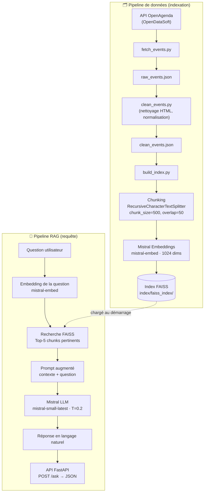
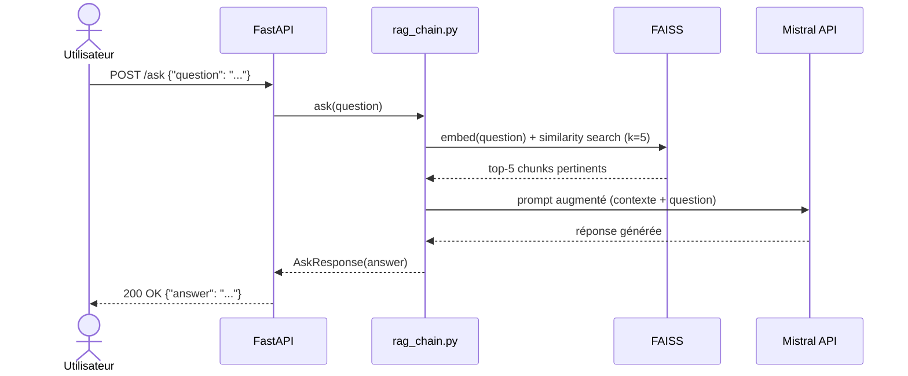

# Rapport technique — Assistant intelligent de recommandation d'événements culturels

**Projet :** POC RAG Puls-Events  
**Auteur :** Raphael  
**Date :** Avril 2026  
**Version :** 0.1.0

---

## Table des matières

1. [Objectifs du projet](#1-objectifs-du-projet)
2. [Architecture du système](#2-architecture-du-système)
3. [Préparation et vectorisation des données](#3-préparation-et-vectorisation-des-données)
4. [Choix du modèle NLP](#4-choix-du-modèle-nlp)
5. [Construction de la base vectorielle](#5-construction-de-la-base-vectorielle)
6. [API et endpoints exposés](#6-api-et-endpoints-exposés)
7. [Évaluation du système](#7-évaluation-du-système)
8. [Recommandations et perspectives](#8-recommandations-et-perspectives)
9. [Organisation du dépôt GitHub](#9-organisation-du-dépôt-github)
10. [Annexes](#10-annexes)

---

## 1. Objectifs du projet

### Contexte

**Puls-Events** est une entreprise technologique développant une plateforme de recommandations culturelles personnalisées. Dans le cadre d'une mission freelance, le présent POC vise à démontrer la faisabilité d'un chatbot intelligent capable de répondre à des questions utilisateurs sur les événements culturels à venir.

### Problématique

Les moteurs de recherche classiques (par mots-clés) ne permettent pas de comprendre l'intention derrière une question comme *"Que faire ce week-end avec mes enfants ?"*. Un système **RAG (Retrieval-Augmented Generation)** répond à ce besoin en combinant :

- Une **recherche sémantique** dans une base d'événements (compréhension du sens, pas juste des mots)
- Une **génération de réponse en langage naturel** à partir des documents retrouvés (réponse contextuelle et formulée)

Cela permet d'offrir une expérience conversationnelle pertinente, ancrée dans des données réelles et récentes.

### Objectif du POC

Démontrer la **faisabilité technique et la valeur métier** d'un assistant de recommandation culturelle basé sur RAG, avec :

- Un pipeline complet de la donnée brute à la réponse générée
- Une API REST interrogeable par les équipes produit et marketing
- Une évaluation automatisée de la qualité des réponses
- Un déploiement conteneurisé reproductible

### Périmètre

| Critère | Valeur |
|---|---|
| Zone géographique | Île-de-France |
| Source de données | API OpenAgenda (via OpenDataSoft) |
| Période couverte | 12 derniers mois + 6 mois à venir |
| Volume d'événements | jusqu'à 1 000 événements |
| Langue | Français |

---

## 2. Architecture du système

### Schéma global



### Diagramme de séquence UML (appel `/ask`)



### Technologies utilisées

| Technologie | Version | Rôle |
|---|---|---|
| Python | ≥ 3.8 | Langage principal |
| LangChain | ≥ 0.2.0 | Orchestration du pipeline RAG |
| langchain-mistralai | ≥ 0.1.0 | Intégration Mistral (LLM + embeddings) |
| FAISS (`faiss-cpu`) | ≥ 1.7.4 | Index de recherche vectorielle |
| FastAPI | ≥ 0.111.0 | API REST + documentation Swagger |
| Uvicorn | ≥ 0.30.0 | Serveur ASGI |
| Ragas | 0.2.15 | Évaluation automatique des réponses |
| Docker | — | Conteneurisation |
| python-dotenv | ≥ 1.0.0 | Gestion des variables d'environnement |

---

## 3. Préparation et vectorisation des données

### Source de données

Les événements sont récupérés via l'**API publique OpenDataSoft** exposant le jeu de données OpenAgenda :

```
https://public.opendatasoft.com/api/explore/v2.1/catalog/datasets/evenements-publics-openagenda/records
```

**Paramètres de filtrage appliqués :**

```python
LOCATION_FILTER = "location_region='Île-de-France'"
DATE_START = (datetime.now() - timedelta(days=365)).strftime("%Y-%m-%d")
DATE_END   = (datetime.now() + timedelta(days=180)).strftime("%Y-%m-%d")
WHERE_FILTER = (
    f"{LOCATION_FILTER} "
    f"AND firstdate_begin >= '{DATE_START}' "
    f"AND firstdate_begin <= '{DATE_END}'"
)
PAGE_SIZE  = 100   # maximum autorisé par ODS
MAX_EVENTS = 1000
```

La pagination est gérée automatiquement avec un offset incrémental jusqu'à 1 000 événements maximum.

### Nettoyage des données (`clean_events.py`)

Le script de nettoyage applique plusieurs transformations :

| Opération | Description |
|---|---|
| **Filtrage champs obligatoires** | Les événements sans titre (`title_fr`) sont écartés |
| **Déduplication** | Les événements avec UID identique sont dédupliqués |
| **Suppression HTML** | Les balises HTML dans `longdescription_fr` sont retirées via regex |
| **Normalisation géographique** | Noms de départements (`Seine-St-Denis` → `Seine-Saint-Denis`), arrondissements parisiens déduits du code postal |
| **Normalisation des quartiers** | Suppression des préfixes `Quartier de / du / des` |
| **Parsing JSON imbriqué** | Champs `attendancemode` et `status` dé-sérialisés pour extraire le label français |
| **Champ texte composite** | Tous les champs utiles sont concaténés dans un champ `text` pour la vectorisation |

**Exemple de champ `text` généré :**
```
Titre : Concert de jazz | Description : Soirée jazz au cœur de Paris. | Dates : 15 avril 2026 |
Lieu : Café de la Danse | Adresse : 5 passage Louis-Philippe, 75011 Paris | Quartier : Charonne |
Département : Paris | Région : Île-de-France | Conditions : Entrée libre
```

**Champs conservés dans les métadonnées :**
`uid`, `title`, `firstdate_begin`, `lastdate_end`, `location_name`, `location_city`, `location_district`, `location_postalcode`, `location_dept`, `location_region`, `conditions`, `age_min`, `age_max`, `url`

### Chunking

Le découpage en chunks est réalisé avec `RecursiveCharacterTextSplitter` :

| Paramètre | Valeur | Justification |
|---|---|---|
| `chunk_size` | 500 caractères | Adapté aux descriptions d'événements (textes courts) |
| `chunk_overlap` | 50 caractères | Évite la perte d'information en limite de chunk |
| `separators` | `[" \| ", "\n\n", "\n", " ", ""]` | Respecte la structure du champ texte composite |

### Embedding

Les vecteurs sémantiques sont générés via l'**API Mistral** :

| Paramètre | Valeur |
|---|---|
| Modèle | `mistral-embed` |
| Dimension | 1024 |
| Type | Float32 |
| Batch | Géré automatiquement par LangChain |

---

## 4. Choix du modèle NLP

### Modèles sélectionnés

Le système utilise **deux modèles Mistral AI** aux rôles distincts :

| Rôle | Modèle | Justification |
|---|---|---|
| **Embeddings** | `mistral-embed` | Modèle dédié à la représentation sémantique, compatible LangChain, performant en français |
| **Génération** | `mistral-small-latest` | Bon rapport qualité/coût, suffisant pour un POC, temps de réponse raisonnable |

### Pourquoi Mistral ?

- **Compatibilité native LangChain** via `langchain-mistralai`
- **Qualité en français** supérieure aux modèles anglais-centrés pour des contenus culturels francophones
- **Coût maîtrisé** adapté à un POC avec volume modéré de requêtes
- **API cloud** : pas d'infrastructure GPU à gérer (contrairement aux modèles locaux HuggingFace)

### Prompt de base

```
Tu es un assistant spécialisé dans les événements culturels.
Réponds à la question en t'appuyant uniquement sur les événements fournis ci-dessous.
Si aucun événement ne correspond, dis-le clairement.

Événements pertinents :
{context}

Question : {question}

Réponse :
```

**Choix de conception :**
- `temperature=0.2` : réponses factuelles et reproductibles, tout en conservant une formulation naturelle
- `k=5` : les 5 chunks les plus proches sémantiquement sont injectés en contexte
- Instruction explicite de transparence sur l'absence de résultat (évite les hallucinations)
- Pas d'historique de conversation (hors périmètre POC)

### Limites du modèle

- **Fenêtre de contexte** : si les 5 chunks sont très longs, le contexte peut être tronqué
- **Dépendance à la qualité du retrieval** : si FAISS ne retrouve pas les bons chunks, le LLM ne peut pas halluciner une bonne réponse (comportement souhaité dans ce cas)
- **Dates relatives** : le modèle ne sait pas quelle est la date actuelle ; des questions comme *"ce week-end"* ne peuvent être résolues précisément
- **Coût API** : chaque appel génère des coûts Mistral (à surveiller en production)

---

## 5. Construction de la base vectorielle

### FAISS utilisé

L'index FAISS est construit via `FAISS.from_documents()` de LangChain, qui utilise par défaut un **index `IndexFlatL2`** (recherche exacte par distance L2). Ce choix est adapté au POC car :

- Le volume de données est limité (< 10 000 chunks)
- La précision est maximale (pas d'approximation)
- Les temps de réponse sont acceptables à cette échelle

### Stratégie de persistance

| Élément | Valeur |
|---|---|
| Répertoire | `index/faiss_index/` |
| Fichiers générés | `index.faiss` + `index.pkl` (métadonnées) |
| Format | Binaire FAISS natif |
| Chargement | `FAISS.load_local()` avec `allow_dangerous_deserialization=True` |

L'index est chargé **une seule fois au démarrage de l'API** et mis en cache en mémoire (`_index`, `_chain`) pour éviter de le recharger à chaque requête.

### Métadonnées associées

Chaque document FAISS conserve les métadonnées suivantes, accessibles après retrieval :

```python
{
    "uid": str,              # Identifiant unique OpenAgenda
    "title": str,            # Titre de l'événement
    "firstdate_begin": str,  # Date de début (ISO 8601)
    "lastdate_end": str,     # Date de fin
    "location_name": str,    # Nom du lieu
    "location_city": str,    # Ville
    "location_district": str,# Arrondissement / quartier
    "location_postalcode": str,
    "location_dept": str,    # Département
    "location_region": str,  # Région
    "conditions": str,       # Conditions d'accès (gratuit, inscription...)
    "age_min": int | None,
    "age_max": int | None,
    "url": str               # Lien vers la page OpenAgenda
}
```

---

## 6. API et endpoints exposés

### Framework utilisé

**FastAPI** a été retenu pour :
- La **génération automatique de la documentation Swagger** (`/docs`)
- La **validation des types** via Pydantic
- Les **performances** (ASGI asynchrone)
- L'**intégration native** avec les schémas de données

### Endpoints

#### `GET /health`
Vérifie que l'API est opérationnelle.

```json
// Réponse 200
{"status": "ok"}
```

#### `GET /metadata`
Retourne des informations sur la base indexée.

```json
// Réponse 200
{
  "total_events": 847,
  "last_rebuilt": "2026-04-07T09:00:00",
  "first_event_date": "2025-04-08T00:00:00+00:00",
  "last_event_date": "2026-10-08T00:00:00+00:00",
  "departments": ["Essonne", "Hauts-De-Seine", "Paris", "Seine-Et-Marne", "Val-De-Marne", "Val-D'Oise", "Yvelines"],
  "districts": ["Belleville", "Charonne", "Montmartre", "Saint-Lambert", ...]
}
```

#### `POST /ask`
Pose une question au système RAG.

**Requête :**
```json
{"question": "Quels concerts gratuits ont lieu à Paris ce mois-ci ?"}
```

**Réponse :**
```json
{
  "answer": "Voici les concerts gratuits prévus à Paris : ..."
}
```

**Codes d'erreur gérés :**

| Code | Cause |
|---|---|
| 422 | Question vide |
| 503 | Index FAISS introuvable (lancer `/rebuild` d'abord) |
| 429 | Limite de requêtes Mistral atteinte |
| 500 | Erreur serveur inattendue |

#### `POST /rebuild` *(authentification requise)*
Reconstruit l'index FAISS depuis les données nettoyées.

**Header requis :** `X-API-Key: <clé configurée dans .env>`

```json
// Réponse 200
{
  "message": "Index FAISS reconstruit avec succès.",
  "chunks_indexed": 3241
}
```

> La route `/rebuild` est protégée par une clé API pour éviter une reconstruction intempestive en cas d'exposition publique.

### Exemples d'appels

**curl :**
```bash
# Vérification de l'état
curl http://localhost:8000/health

# Question au système RAG
curl -X POST http://localhost:8000/ask \
  -H "Content-Type: application/json" \
  -d '{"question": "Y a-t-il des spectacles pour enfants en Île-de-France ?"}'

# Reconstruction de l'index
curl -X POST http://localhost:8000/rebuild \
  -H "X-API-Key: votre_cle_api"
```

**Python requests :**
```python
import requests

response = requests.post(
    "http://localhost:8000/ask",
    json={"question": "Quels événements musicaux sont prévus à Versailles ?"}
)
print(response.json()["answer"])
```

### Documentation interactive

La documentation Swagger est disponible automatiquement à l'adresse :
```
http://localhost:8000/docs
```

---

## 7. Évaluation du système

### Jeu de test annoté

Un jeu de données de référence de **15 questions annotées manuellement** a été constitué dans `tests/annotated_qa.json`.

**Critères de construction :**
- Couverture des principaux cas d'usage (événements gratuits, par genre musical, par localisation, pour enfants...)
- Inclusion de questions hors périmètre (Lyon, rap/hip-hop) pour tester la capacité à dire "je ne sais pas"
- Questions ambiguës (sans date précise) pour identifier les limitations
- Annotation des réponses attendues en langage naturel

**Exemples de questions annotées :**

| # | Question | Type |
|---|---|---|
| 1 | Y a-t-il des ateliers artistiques en Île-de-France ? | Cas nominal |
| 2 | Quels événements culturels gratuits sont prévus à Paris ? | Filtre conditions |
| 7 | Y a-t-il des événements pour enfants ? | Public cible |
| 13 | Y a-t-il des événements à Lyon ou Marseille ? | Hors périmètre |
| 15 | Que faire ce week-end en Île-de-France ? | Question ambiguë |

### Métriques d'évaluation

L'évaluation automatique est réalisée avec **Ragas**, qui utilise lui-même le LLM Mistral pour scorer chaque réponse :

| Métrique | Description |
|---|---|
| **answer_relevancy** | La réponse répond-elle bien à la question posée ? |
| **faithfulness** | La réponse est-elle fidèle aux documents retrouvés (pas d'hallucination) ? |
| **context_precision** | Les chunks retrouvés sont-ils pertinents (peu de bruit) ? |
| **context_recall** | Toutes les informations nécessaires ont-elles été récupérées ? |

### Résultats obtenus

Évaluation réalisée le **7 avril 2026** sur les 15 questions annotées.

| Métrique | Score moyen | Interprétation |
|---|---|---|
| **faithfulness** | **0.829** | Bonne fidélité — le LLM s'appuie bien sur les documents fournis |
| **answer_relevancy** | **0.761** | Pertinence correcte — les réponses répondent à la question |
| **context_recall** | **0.633** | Rappel moyen — certaines informations pertinentes ne sont pas toujours récupérées |
| **context_precision** | **0.490** | Précision à améliorer — du bruit dans les chunks récupérés |

#### Analyse qualitative

**Points forts :**
- La `faithfulness` élevée (0.829) indique que le modèle ne fabrique pas d'informations : il répond sur la base de ce qu'il a retrouvé, et dit clairement quand rien ne correspond
- Les questions avec des événements clairement référencés reçoivent des réponses détaillées et précises (Q2 : événements gratuits à Paris — `faithfulness` 0.958, `context_recall` 1.0)
- La gestion des cas hors périmètre fonctionne bien (Q13 : Lyon/Marseille → réponse correcte d'absence)

**Points faibles :**
- La `context_precision` faible (0.490) révèle que FAISS remonte parfois des chunks non directement liés à la question
- Q1 (ateliers artistiques) illustre un cas de mauvaise précision : le retriever remonte des ateliers professionnels (numérique, emploi) au lieu d'ateliers artistiques, ce qui conduit le LLM à répondre incorrectement "Non, il n'y en a pas"
- Q15 (que faire ce week-end ?) ne peut être traitée précisément car la date courante n'est pas injectée dans le prompt

**Exemples de résultats détaillés :**

| Question | faithfulness | answer_relevancy | context_precision | context_recall |
|---|---|---|---|---|
| Q2 — Événements gratuits Paris | 0.958 | N/A | 0.000 | 1.000 |
| Q3 — Stand-up Île-de-France | 0.875 | 0.905 | 0.833 | 1.000 |
| Q1 — Ateliers artistiques | 0.333 | 0.858 | 0.000 | 0.000 |

### Automatisation de l'évaluation

Le script `tests/evaluate_rag.py` est entièrement automatisable :

```bash
# Évaluation simple
python tests/evaluate_rag.py

# Évaluation avec sauvegarde des résultats
python tests/evaluate_rag.py --output results/eval_results.json
```

Il peut être intégré dans un pipeline CI (GitHub Actions) pour une surveillance continue de la qualité.

---

## 8. Recommandations et perspectives

### Ce qui fonctionne bien

- Le pipeline de bout en bout est fonctionnel et reproductible
- La fidélité des réponses est bonne : le système évite les hallucinations
- La gestion des cas hors périmètre (hors Île-de-France, hors base) est correcte
- L'API est documentée, testée, conteneurisée et prête pour une démo

### Limites du POC

| Limite | Impact |
|---|---|
| **Volume limité (1 000 événements)** | La couverture thématique est partielle |
| **Pas de date courante dans le prompt** | Questions relatives ("ce week-end") non traitables précisément |
| **Index `IndexFlatL2`** | Ne passera pas à l'échelle sur des millions de documents |
| **Pas de filtering post-retrieval** | Chunks hors sujet parfois inclus dans le contexte |
| **Coût API Mistral** | Chaque embed + génération est facturé |
| **Pas d'historique de conversation** | Les sessions multi-tours ne sont pas supportées |
| **Pas de streaming** | Le temps d'attente peut être perçu comme long côté utilisateur |

### Améliorations possibles

**À court terme :**
- **Injection de la date courante** dans le prompt pour gérer les questions temporelles relatives
- **Filtrage par métadonnées** (date, département, conditions) avant ou après le retrieval FAISS
- **Hybrid search** : combiner la recherche sémantique FAISS avec une recherche par mots-clés (BM25) pour améliorer la précision

**À moyen terme :**
- **Augmenter le volume de données** : récupérer l'ensemble des événements OpenAgenda France et affiner le filtrage côté utilisateur
- **Passer à un index FAISS IVF** (IndexIVFFlat) pour passer à l'échelle sur des millions de vecteurs
- **Streaming des réponses** via FastAPI `StreamingResponse` pour améliorer l'UX
- **Historique de conversation** via `ConversationBufferMemory` LangChain

**Passage en production :**
- Mettre en place un **pipeline de mise à jour automatique** de l'index (hebdomadaire ou quotidien)
- Ajouter un **cache Redis** pour les questions fréquentes
- Déployer sur une infrastructure cloud (AWS ECS, GCP Cloud Run) avec auto-scaling
- Monitorer les métriques Ragas en continu via une tâche GitHub Actions planifiée

---

## 9. Organisation du dépôt GitHub

```
poc-rag/
├── api/
│   ├── main.py          # Point d'entrée FastAPI
│   ├── routes.py        # Définition des endpoints (/ask, /rebuild, /health, /metadata)
│   ├── schemas.py       # Modèles Pydantic (requêtes/réponses)
│   └── security.py      # Vérification clé API (X-API-Key)
│
├── scripts/
│   ├── fetch_events.py  # Récupération des événements via API OpenDataSoft
│   ├── clean_events.py  # Nettoyage et normalisation des données brutes
│   ├── build_index.py   # Chunking, embeddings Mistral, construction index FAISS
│   └── rag_chain.py     # Pipeline RAG : retrieval FAISS + génération Mistral
│
├── tests/
│   ├── annotated_qa.json       # 15 questions/réponses annotées manuellement
│   ├── evaluate_rag.py         # Évaluation automatique Ragas
│   ├── test_fetch_events.py    # Tests unitaires fetch_events
│   ├── test_preprocessing.py   # Tests unitaires clean_events
│   ├── test_build_index.py     # Tests unitaires build_index
│   ├── test_rag_chain.py       # Tests unitaires rag_chain
│   └── api_test.py             # Tests fonctionnels de l'API
│
├── docs/
│   ├── rapport_technique.md    # Ce rapport
│   └── puls-events-demo.postman_collection.json  # Collection Postman
│
├── data/                # Données brutes et nettoyées (non versionné — .gitignore)
├── index/               # Index FAISS persisté (non versionné — .gitignore)
├── results/             # Résultats d'évaluation JSON
│
├── Dockerfile           # Image Docker pour l'API
├── Makefile             # Commandes raccourcies (build, run, test...)
├── requirements.txt     # Dépendances Python
├── conftest.py          # Configuration pytest
├── .env.example         # Template variables d'environnement
└── README.md            # Documentation de démarrage rapide
```

**Répertoires non versionnés (`data/`, `index/`) :** ces dossiers contiennent des données volumineuses ou des fichiers binaires générés à l'exécution. Un fichier `.gitignore` les exclut du dépôt. Les scripts permettent de les reconstituer entièrement.

---

## 10. Annexes

### Annexe A — Extraits du jeu de test annoté

```json
[
  {
    "id": 2,
    "question": "Quels événements culturels gratuits sont prévus à Paris ?",
    "expected_answer": "Plusieurs événements culturels gratuits sont proposés à Paris, notamment des visites, spectacles et activités accessibles librement selon la programmation disponible."
  },
  {
    "id": 13,
    "question": "Y a-t-il des événements culturels à Lyon ou Marseille ?",
    "expected_answer": "Aucun événement à Lyon ou Marseille n'est disponible dans le système. La base de données couvre uniquement les événements en Île-de-France."
  },
  {
    "id": 15,
    "question": "Que faire ce week-end en Île-de-France ?",
    "expected_answer": "La question ne précise pas quel week-end est concerné. Pour proposer des suggestions pertinentes, il faudrait indiquer une date ou des préférences d'activités."
  }
]
```

### Annexe B — Prompt complet utilisé

```
Tu es un assistant spécialisé dans les événements culturels.
Réponds à la question en t'appuyant uniquement sur les événements fournis ci-dessous.
Si aucun événement ne correspond, dis-le clairement.

Événements pertinents :
{context}

Question : {question}

Réponse :
```

*Paramètres de génération : `model=mistral-small-latest`, `temperature=0.2`*  
*Paramètres de retrieval : `k=5` (top-5 chunks par similarité cosinus)*

### Annexe C — Exemples de réponses JSON

**Question Q3 — Stand-up :**
```json
{
  "answer": "Oui, il y a un spectacle de stand-up en Île-de-France :\n\n**Stand-up autour du thème de l'argent**\n- **Description** : Spectacle de stand-up mêlant humour et réflexions sur notre relation avec l'argent.\n- **Date** : Samedi 4 avril à 17h00\n- **Lieu** : Médiathèque Ulysse, Saint-Denis (93)\n- **Accès** : Libre (à partir de 13 ans)\n- **Adresse** : 37 cours du Rû de Montfort, 93200 Saint-Denis"
}
```

**Cas hors périmètre Q13 — Lyon/Marseille :**
```json
{
  "answer": "Il n'y a pas d'événements à Lyon ou Marseille dans les données fournies. Les événements disponibles sont uniquement situés en Île-de-France."
}
```

### Annexe D — Commandes Docker

```bash
# Construction de l'image
docker build -t puls-events-rag .

# Lancement du conteneur (avec index et données montés en volume)
docker run -p 8000:8000 \
  --env-file .env \
  -v $(pwd)/data:/app/data \
  -v $(pwd)/index:/app/index \
  puls-events-rag

# Test rapide post-démarrage
curl http://localhost:8000/health
```

### Annexe E — Résultats complets Ragas

| # | Question (résumé) | faithfulness | answer_relevancy | context_precision | context_recall |
|---|---|---|---|---|---|
| Q1 | Ateliers artistiques | 0.333 | 0.858 | 0.000 | 0.000 |
| Q2 | Événements gratuits Paris | 0.958 | N/A | 0.000 | 1.000 |
| Q3 | Stand-up Île-de-France | 0.875 | 0.905 | 0.833 | 1.000 |
| Q4 | Concerts Versailles | — | — | — | — |
| Q5 | Visites guidées | — | — | — | — |
| Q6 | Concerts entrée libre | — | — | — | — |
| Q7 | Événements enfants | — | — | — | — |
| Q8 | Musique classique | — | — | — | — |
| Q9 | Gastronomie | — | — | — | — |
| Q10 | Événements Yvelines | — | — | — | — |
| Q11 | Jardins et espaces naturels | — | — | — | — |
| Q12 | Seine-et-Marne | — | — | — | — |
| Q13 | Lyon / Marseille | — | — | — | — |
| Q14 | Rap / Hip-hop | — | — | — | — |
| Q15 | Que faire ce week-end | — | — | — | — |
| **Moyenne** | | **0.829** | **0.761** | **0.490** | **0.633** |

*Les scores détaillés par question sont disponibles dans `results/eval_results.json`.*
